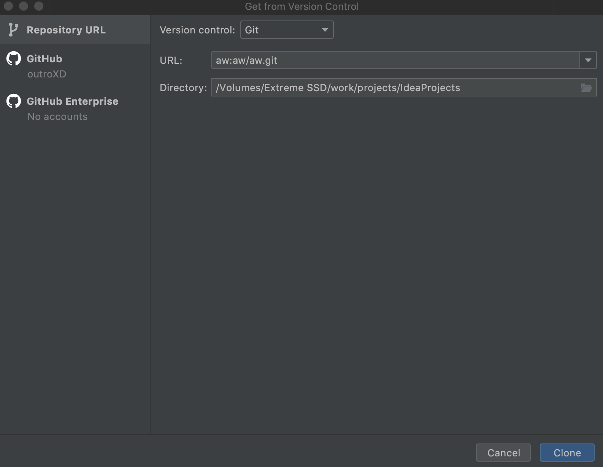

# Tips
## Intellij IDEA + GitlabでSSH経由でcloneする
* IntelliJでVCから取得する時、分かりづらかったのでメモ。  
* 前提として~/.ssh/configの各種設定は済んでいるbものとする。

1. `Welcome to IntelliJ IDEA`で`Get from VCS`を選択する。
2. `URL`は`<~/.ssh/configで設定したホスト名>:path/to/hoge.git`の形で指定るする。  

(2)の設定画面例  
