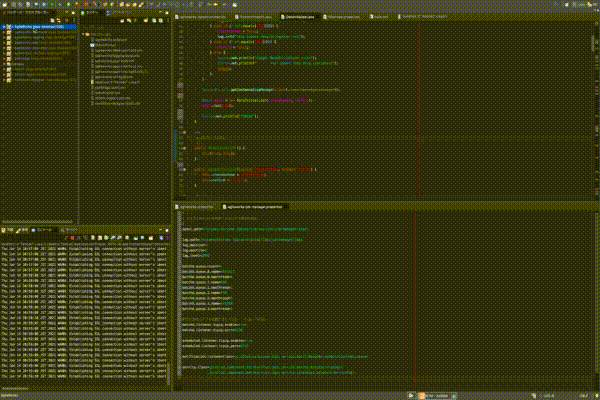
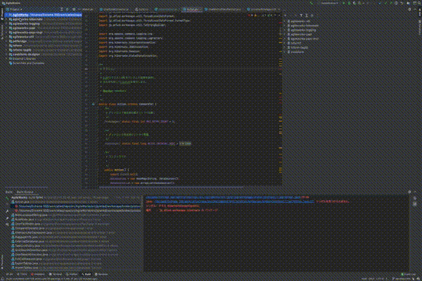
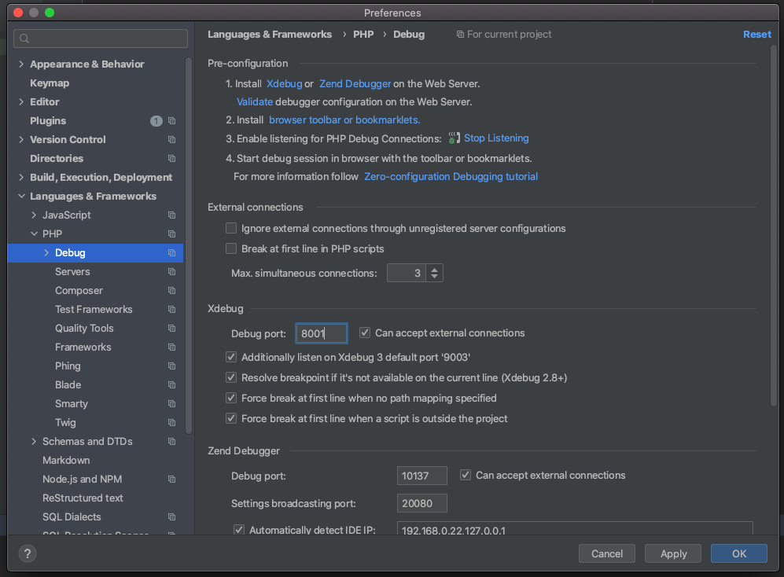
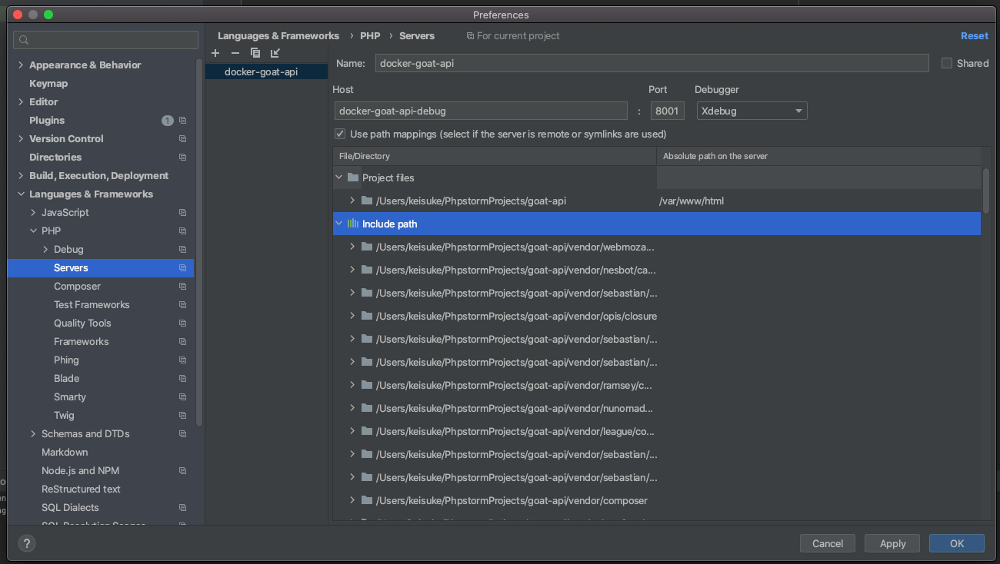

# Tips
## Intellij IDEA ⇆ Eclipse 移行メモ
* Intellij IDEAとEclipseだと、概念ややりたいことの実現方法が色々異なる。「Eclipseでやっていたこの作業、Intellij IDEAではどうやるのか？」という観点でメモ。
### Javaプロジェクトのビルドパスにソース/プロジェクト/ライブラリを追加する
#### Eclipse

#### Intellij IDEA



## Docker + Phpstorm + Laravelでローカルリモートデバッグ環境を整える
**TODO まだ書きかけ**
### コンテナ内でxdebugをインストール
```Dockerfile
RUN pecl install xdebug && \
    docker-php-ext-install mysqli pdo_mysql && \
    docker-php-ext-enable xdebug
RUN docker-php-ext-configure gd --with-freetype-dir=/usr/include/ --with-jpeg-dir=/usr/include/ && \
    docker-php-ext-install gd
```
### php.iniの設定
```ini
[xdebug]
zend_extension=xdebug.so
xdebug.idekey="PHPSTORM-GOAT-API"
xdebug.default_enable=1
xdebug.remote_enable=1
xdebug.remote_autostart=1
xdebug.remote_connect_back=0
xdebug.remote_log="/tmp/xdebug.log"
xdebug.remote_port=8001
xdebug.remote_host=docker.for.mac.host.internal
```
### Phpstormの設定
* `Phpstorm` > `Preference` > `Language & Frameworks` > `PHP` > `Debug` > `Debug port`の値をphp.iniのxdebug.remote_portと合わせる。
  * 
* `Phpstorm` > `Preference` > `Language & Frameworks` > `PHP` > `Server`を設定する。
  * 
  
  
  
## Intellij IDEA + GitlabでSSH経由でcloneする
* IntelliJでGitlabからcloneする時、設定方法が分かりづらかったのでメモ。  
* 前提として~/.ssh/configの各種設定は済んでいるbものとする。

1. `Welcome to IntelliJ IDEA`で`Get from VCS`を選択する。
2. `URL`は`<~/.ssh/configで設定したホスト名>:path/to/hoge.git`の形で指定する。  

(2)の設定画面例  
