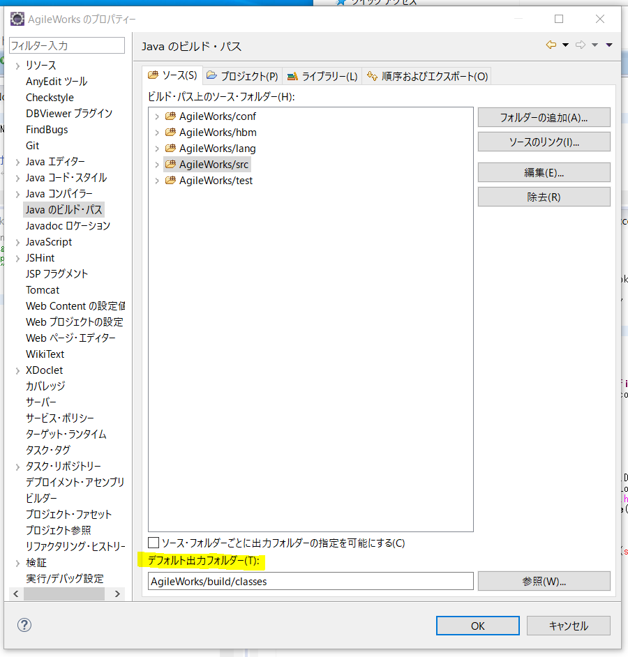

# 環境構築
## 実行環境
* Windows10 Pro
* Eclipse4.4
  * AgileworksはJava1.6でビルドできる必要がある。
  * 最新版Eclipseに付属するAntではJava1.8以下をビルドすることができない。  
    最新バージョンがツールに含まれるIDEなどで構築する際はantのバージョンを`1.9`以下に下げること。 
* SourceTree
* MySQL(Docker)
  * version: 5.7.*
## 参考
* [AgileWorks環境構築](https://sites.google.com/a/atled.jp/agileworks/dev-env/agileworks)


# データベース
コンテナ定義を下記に記載する。  
以下は自分の例。各位環境に合わせる必要がある。
## Dockerfile
```dockerfile
FROM mysql:5.7.16

USER root
ADD ./cnf/my.cnf /etc/mysql/my.cnf
RUN chmod 644 /etc/mysql/my.cnf

USER mysql
```
## docker-compose.yml
```yaml
version: '3'
services:
  work-atled-mysql:
    build: .
    container_name: work-atled-mysql
    environment:
      MYSQL_ROOT_PASSWORD: agileworks
      TZ: 'Asia/Tokyo'
    ports:
      - 3306:3306
    volumes:
      - /mnt/d/work/atled/libs/docker/mysql/data:/var/lib/mysql
      - ./sql:/docker-entrypoint-initdb.d
```


# tomcat
## ダウンロード


# ソースのclone ~ Eclipseへ登録
* sshエージェントにて公開鍵認証の設定を済ませておくこと。
  * gitlab側に公開鍵を登録。
  * sshエージェントに秘密鍵を登録。
* sshでclone。
  * ssh://git@git.atledcloud.jp:10022/aw/aw.git

# Checkstyle
## プラグインのインストール
* [SourceForge](https://sourceforge.net/projects/eclipse-cs/files/Eclipse%20Checkstyle%20Plug-in/) よりバージョン`5.5.0`をダウンロードする。  
* ダウンロードしたファイルを解凍後、中に含まれる``と``をにコピペする。
## 設定
* EclipseのCheckstyleのグローバル定義にatled独自定義のCheckstyleを登録する。
* `ウィンドウ` > `設定` > `Checkstyle` > `新規`
  * `型`を`外部構成`に設定。
  * `名前`に任意の名前を設定。
  * `ロケーション`から`AgileWorks/agileworks_checks.xml`を設定する。
  * 登録したCheckstyleをグローバルのCheckstyleに設定する。
    

# agileworks-util
* JREシステムライブラリー
  * `java6`
  

# sgileworks-hibernate
* JREシステムライブラリー
  * `java6`


# agileworks-logging
* JREシステムライブラリー
  * `java6`
## hibernate.propertiesの設定
* 先方によるとこのファイルは無くても動作するらしい。
```ini
####################################
# Hibernate system info for default connection
####################################

####################################
# DB connect properties for Develop
####################################
#hibernate.dialect = org.hibernate.dialect.MySQLDialect
#hibernate.connection.driver_class = com.mysql.jdbc.Driver
#hibernate.connection.url = jdbc:mysql://localhost:3306/sample4
#hibernate.connection.username = sample
#hibernate.connection.password = sample

hibernate.dialect = jp.atled.workscape.hibernate.dialect.AwMySQLDialect
hibernate.connection.driver_class = com.mysql.jdbc.Driver
hibernate.connection.url = jdbc:mysql://localhost:3306/agileworks
hibernate.connection.username = agileworks
hibernate.connection.password = agileworks

hibernate.connection.isolation = 2
hibernate.connection.release_mode = on_close

hibernate.c3p0.min_size = 10
hibernate.c3p0.max_size = 50
hibernate.c3p0.timeout = 1800
hibernate.c3p0.max_statements = 100

hibernate.cache.provider_class = org.hibernate.cache.HashtableCacheProvider

hibernate.show_sql = true
hibernate.format_sql = false
hibernate.use_sql_comments = false

####################################
# DB connect properties for OC4J
####################################
#hibernate.dialect = org.hibernate.dialect.Oracle10gDialect
#hibernate.cache.provider_class = org.hibernate.cache.HashtableCacheProvider
#hibernate.show_sql = false
#hibernate.format_sql = false
#hibernate.use_sql_comments = false

## JNDI Datasource
#hibernate.connection.datasource = java:comp/env/hibernate/SessionFactory
#hibernate.transaction.manager_lookup_class = org.hibernate.transaction.OC4JTransactionManagerLookup
#hibernate.transaction.factory_class = org.hibernate.transaction.JDBCTransactionFactory
```


# agileworks-papi
* JREシステムライブラリー
  * `java6`


# tsform
* JREシステムライブラリー
  * `java6`
* テキストファイルのエンコード
  * `MS932`
  

# tsform-taglib
* JREシステムライブラリー
  * `java6`
* テキストファイルのエンコード
  * `MS932`
  

# xwebform-designer
* JREシステムライブラリー
  * `java6`
* テキストファイルのエンコード
  * `MS932`


# Agileworks
## agileworks_system.propertiesの設定
* エンコーディングは`UTF-8`。
```ini
####################################
# System properties
#
# R2.4.0 以降用
####################################

# prefix を指定して、複数環境の設定を簡単に切り替えられる
#Configuration.prefix = development
#development.Database.type = XXXX
#test.Database.type = YYYY
#production.Database.type = ZZZZ
Configuration.prefix = development
development.Database.type = javax.sql.DataSource
test.Database.type = javax.sql.DataSource
production.Database.type = javax.sql.DataSource

# ServerMode サーバモード 指定のない場合は運用モードとなります
# 運用モード:active
# ステージングモード:standby
# テスト/開発環境:development
# マルチテナントモード:multidomain
# テナントマネージャー:tenantmanager
#System.serverMode = active

# データベースの種類を指定します
# Oracle, MySQL or SQLServer
#Database.type = XXXX
Database.type = MySQL

# ユーザーデータソースのスキーマ名
#Database.user.schema = XXXX
Database.user.schema = agileworks

# ==== 組込コネクションプールを使う場合 ====
### システムスキーマ
#Database.system.username =
#Database.system.password =
#Database.system.url =
Database.system.username = agileworks
Database.system.password = agileworks
Database.system.driverClassName = com.mysql.jdbc.Driver
Database.system.url = jdbc:mysql://localhost:3306/agileworks

# プール数
#Database.system.pool.maxsize = 30

# 最小プール数を指定する場合に指定（運用時　非推奨）
#Database.system.pool.minsize = 0

# 最小プール数を指定した場合の実際にコネクションをクローズするまでの生存時間（秒単位）
#Database.system.pool.timeout = 120

### ユーザースキーマ
#Database.user.username =
#Database.user.password =
#Database.user.url =
Database.user.username = agileworks_user
Database.user.password = agileworks_user
Database.system.driverClassName = com.mysql.jdbc.Driver
Database.user.url = jdbc:mysql://localhost:3306/agileworks_user

# プール数
Database.user.pool.maxsize = 30

# 最小プール数を指定する場合に指定（運用時　非推奨）
Database.user.pool.minsize = 5

# 最小プール数を指定した場合の実際にコネクションをクローズするまでの生存時間（秒単位）
Database.user.pool.timeout = 1600
# ==== 組込コネクションプールを使う場合 ====

# ==== JNDI を使う場合 ====
# hibernate manager_lookup_class を指定
#Database.manager_lookup_class = org.hibernate.transaction.OC4JTransactionManagerLookup
# システムデータソースの JNDI 名を指定
#Database.system.datasource = java:comp/env/hibernate/SessionFactory/system
# ユーザーデータソースの JNDI 名を指定
#Database.user.datasource = java:comp/env/hibernate/SessionFactory/user
# ==== JNDI を使う場合 ====


####################################
# ログ
####################################

# ログの出力先
# DB データベース(通常)
# FILE ファイル(下位互換)
# CONSOLE 標準出力
# JOB ジョブマネージャー
# DEBUG logback.xml をそのまま使う
Logging.output.type = DB

# ログの出力先ディレクトリ
# FILE or DB 指定時に有効
# Logging.output.dir = /var/logs/aw
 Logging.output.dir = D:/work/atled/app2/log

# システムログのログレベル
Logging.level.system = DEBUG
Logging.output.console = true

####################################
# メールサービス
####################################

# MailSender enabled(true|false)
MailService.enabled = true

# MailSender refresh interval (min)
MailService.refresh.interval = 1

# MailSender mail send retry count
MailService.send.retryCount = 3

####################################
# ストレージ設定
# MySQL の場合は db: 非推奨
# MySQL でクラスタを使用する場合は
#  Storage.system.location
#  Storage.repository.location.n
# には共用ディスク(NFS等)を使用すること
####################################

# 一時ファイル保存場所（ローカルファイルシステム推奨）
#Storage.draft.location = db:/var/agileworks/storage/draft
Storage.draft.location = db:D:/work/atled/app2/storage/draft

# システムファイル保存場所
# Storage.system.location = db:
Storage.system.location = db:D:/work/atled/app2/system

# 添付ファイルなどのトランザクション系データのレポジトリ設定
Storage.repository.current = 0
#Storage.repository.location.0 = db:
Storage.repository.location.0 = db:D:/work/atled/app2/tran
#Storage.repository.location.0 = db:C:\app2\tran

# SQL ServerでストレージのBlob列に書き込み時に確保する
# 内部バッファのサイズ(KB)
#Storage.sqlserver.buffersize.kb = 512

# アップロードファイルの一時保存場所（ローカルファイルシステム推奨）
# Upload.first.location = /var/agileworks/storage/upload
Upload.first.location = D:/work/atled/app2/storage/upload
#Upload.first.location = C:\app2\storage\upload

####################################
# その他設定
####################################

# password encrypt (NONE|UnixCrypt|MD5|SHA256)
#Password.encrypt.type = SHA256

# workflow policy
#Workflow.policy.prohibitcriteriondatechange = false

# set false if don't display user code
#Display.userinfo.usercode = true

# サブフォーム機能を有効とするかどうか
#View.SubSheet.enabled = true

# ライセンスファイルやログ設定のリロードタイミング
#Schedule.systemloader.interval = 60s

# cluster specified id
#System.clusterId = srv01

# テナントスペースマネージャのコンテキストルートを変更する場合に指定します
# %1$s: host, %2$d port
#TSM.url.format = http://%s:%d/AgileWorksTSM/

# Tenant Space Manager port number.
#TSM.port.number = 9233

# インポートデータディレクトリ(jobmanager 経由の場合は省略可)
#Import.orgimp.data.path = /var/agileworks/import/org_import

####################################
# 障害解析/デバッグ用設定
####################################

# AgileWorks environment mode(development|production)
#AgileWorks.environment = development

# テナントマネージャをマルチテナントの１テナントとして動作可能にする
#AgileWorks.environment.enableTM = true

# コンソールへのログ出力を有効にする場合 true
# Logging.output.console = true

# リソース解放状況などの診断情報を出力する場合にコメントを外す
#Schedule.diagnosis.interval   = 5s
#Schedule.diagnosis.db.timeout = 15s

# 起動時のスキーマチェックを無効にする場合はコメントを外す
#System.validator.schema = false

# スロークエリースレッショルド（msec）
Diagnosis.slowquery.threshold = 250

# 認証チェックのメッセージ
#System.authenticate.extrepository.insessioncheck.errormessage = Xxxxx

# キャッシュマネージャの二次キャッシュを有効にするかどうか.
#Cache.secondarycache.enable = false

# 子組織のソート順序にソート番号を使う場合に true にする
# SCS向け R1.4 までの動作に戻すオプション.
#Org.ChildUnitOrder.UseSortNo = false

# Derby ページキャッシュサイズの指定（デフォルト 1000）
# 10000 で 40MB ほどキャッシュを必要とする模様
# キャッシュは常に確保され続け、解放されない
#derby.storage.pageCacheSize = 1000

# ThreadSafeStopWatch 実行時にメモリー情報も付与する場合は true を指定
# ※ただし、速度が遅くなるので注意
#jp.atled.workscape.site.diagnosis.ThreadSafeStopWatch.AppendMemoryInfo = false

# ClusterId にホスト名を使用する
System.lookup.hostname = true

# 遅延初期化設定
System.Broker.initialize.delay = true

# トランザクションを開始すべきところで開始していない場合のエラーを無視するかどうか
# デフォルト無視
# false を設定するとエラーが発生する様になる（インストーラでインストールした場合のデフォルト）
Plugin.transaction.disregardError = false

# コメント付き承認操作時のコメント入力必須チェック有無
# false: 必須(R2.3以降のデフォルト動作)
# true: 任意（R2.2互換)
#View.DisableWorkflowCommentRequireCheck = true

# コメント編集を禁止するかどうか [APPROVED|ALWAYS]
# 省略時: 禁止しない
# APPROVED: 承認完了後は禁止
# ALWAYS: 常に禁止
#View.DisableDocCommentEdit = APPROVED

# agileworks-job-manager.properties を変更せずに同梱型のジョブマネージャを無効にしたい（外部に切り替えたい）場合には以下のコメントを外す
#jobmanager.enabled = false

# 全文検索機能を一時的に無効にしたい場合には以下のコメントを外す （書類がいっぱいある DB に一時的に切り替えるなど）
#docindex.enabled = false
```
## agileworks-job-manager.propertiesの設定
* `spool.path`、`log.path`の値を環境に合わせて設定する。
* エンコーディングは`UTF-8`。
```ini
#
# ジョブマネージャを内部で立ち上げる場合の設定.
#
# spool.path=/Volumes/Extreme SSD/work/atled/libs/job-manager/spool
spool.path=D:/work/atled/app2/job/spool

# log.path=/Volumes/Extreme SSD/work/atled/libs/job-manager/logs
log.path=D:/work/atled/app2/job/logs
log.maxsize=1
log.maxfile=1
log.level=INFO

batchd.queue.count=4
batchd.queue.0.name=DEFAULT
batchd.queue.0.maxthread=8
batchd.queue.1.name=IMP
batchd.queue.1.maxthread=1
batchd.queue.2.name=TSM
batchd.queue.2.maxthread=1
batchd.queue.3.name=SYSTEM
batchd.queue.3.maxthread=1

#TCP/IP版リスナを起動するかどうか	true｜false
batchd.listener.tcpip.enable=true
batchd.listener.tcpip.port=9230

scheduled.listener.tcpip.enable=true
scheduled.listener.tcpip.port=9231

notification.listenerClass=jp.atled.workscape.impl.service.batch.BatchServerNotificationListener

service.class=jp.atled.component.batchservice.impl.service.batchd.BatchServiceImpl\
             ,jp.atled.component.batchservice.impl.service.scheduled.SchedulerServiceImpl
```
## AgileWorks/service/job-manager/spoolのコピー
* `AgileWorks/service/job-manager/spool`配下のフォルダを全て、`agileworks-job-manager.propertiesのspool.path`で設定したディレクトリ配下へコピーする。
## クラスファイルの配備先を設定
* この設定をしないとagileworks-papi-implのビルド時にクラスファイルを見に行くことができず、ビルドが通らない。
* AgileWorksプロジェクトを右クリック > ビルドパス > ビルドパスの構成 よりプロジェクトのプロパティファイルを開く。
* Javaのビルドパス > 「ソース」タブを開いて、「デフォルト出力フォルダー」を設定する。  
  
## jarの配備
* 下記jarファイルを`WebContent/WEB-INF/lib`配下にコピペする。
  * `agileworks-util.jar`
  * `agileworks-hibernate.jar`
  * `agileworks-logging.jar`
  * `agileworks-papi.jar`
  * `agileworks-papi-impl.jar`
  * `servlet-api.jar`(tomcatに付属)
  * `jsp-api.jar`(tomcatに付属)
  * `tomcat-api.jar`(tomcatに付属)
## ビルドパスの設定
### ソース
* `AgileWorks/src`
* `AgileWorks/test`
* `AgileWorks/conf`
* `AgileWorks/lang`
* `AgileWorks/hbm`
### プロジェクト
* `agileworks-util`
* `agileworks-hibernate`
* `agileworks-logging`
* `agileworks-papi`
* `agileworks-papi-impl`
* `pdfbridge`
* `tsform`
* `tsform-taglib`
* `xwebform-designer`


# agileworks-papi-impl
* JREシステムライブラリー
  * `java6`
  

# 環境構築自動化スクリプト
## 前提
* python3.8.*
* ソースは既にclone済であるものとする。
## ソース
```python
```
# エラー対応履歴
## 